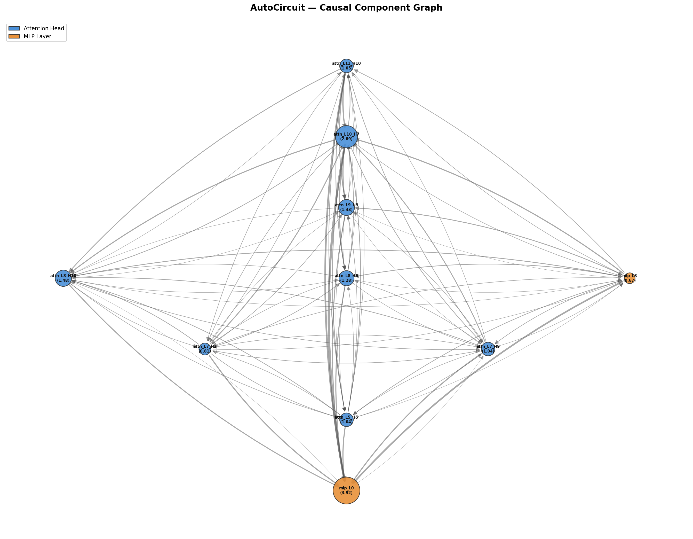

# AutoCircuit

Automated causal circuit discovery for transformer models using activation patching. Given clean/corrupted prompt pairs, AutoCircuit identifies which attention heads and MLP layers are causally responsible for a specific model behavior, measures pairwise information flow between them, and proves the discovered circuit is both necessary and sufficient.

Built with TransformerLens. Validated on GPT-2 Small with the Indirect Object Identification (IOI) task.



*Causal circuit for GPT-2 on IOI. Node size = importance, edge thickness = directional influence. Blue = attention heads, orange = MLP layers.*

---

## Results

**Model:** GPT-2 Small (124M params, 12 layers, 12 heads)
**Task:** Indirect Object Identification - 8 clean/corrupted prompt pairs
**Components scored:** 156 (144 attention heads + 12 MLP layers)
**Metric:** logit(target) - logit(best alternative) at last position
**Hardware:** Apple M-series CPU, 8 GB RAM, ~37s per example

### Baselines

| Metric | Single example | Averaged (n=8) |
|--------|:-:|:-:|
| Clean logit diff | +1.66 | +1.33 |
| Corrupted logit diff | -2.48 | -2.40 |
| Drop | +4.14 | +3.73 |

### Top 15 components (averaged over 8 examples)

| Rank | Component | Score |
|:--:|-----------|:----:|
| 1 | `mlp_L0` | 3.575 |
| 2 | `attn_L5_H5` | 1.400 |
| 3 | `attn_L8_H6` | 1.202 |
| 4 | `attn_L8_H10` | 1.100 |
| 5 | `attn_L7_H9` | 0.920 |
| 6 | `attn_L9_H9` | 0.744 |
| 7 | `attn_L3_H0` | 0.590 |
| 8 | `attn_L7_H3` | 0.564 |
| 9 | `attn_L10_H0` | 0.541 |
| 10 | `attn_L9_H7` | 0.527 |
| 11 | `attn_L6_H9` | 0.516 |
| 12 | `mlp_L5` | 0.400 |
| 13 | `attn_L5_H9` | 0.285 |
| 14 | `attn_L10_H10` | 0.231 |
| 15 | `attn_L0_H1` | 0.225 |

Scores are averaged across 8 diverse IOI prompts to filter out per-example noise. A single prompt can activate rare circuit paths - averaging ensures the ranking reflects the task-general circuit, not input-specific artifacts. The same methodology is used in [Wang et al. (2022)](https://arxiv.org/abs/2211.00593).

---

## Validation

### Sufficiency test

Restore *only* the top-K clean activations into a corrupted run. If the circuit is sufficient, the model should recover correct behavior.

| K | Mean Recovery |
|:-:|:------------:|
| 1 | 95.4% |
| 3 | 98.2% |
| 5 | 102.5% |
| 10 | 103.7% |
| 15 | 103.1% |

A single component (`mlp_L0`) recovers 95% of the correct behavior - and it is selected as the top component on all 8 examples unanimously. Three components exceed full recovery. Recovery exceeding 100% at K=5+ is expected - patching multiple clean activations creates a slightly cleaner residual stream than the original clean run.

### Ablation test

Zero out the top-K components during a clean forward pass. If the circuit is necessary, performance should drop.

| K | Clean | Ablated | Drop |
|:-:|:-----:|:------:|:----:|
| 1 | +1.33 | -4.20 | 416% |
| 3 | +1.33 | -5.82 | 537% |
| 5 | +1.33 | -5.89 | 543% |
| 10 | +1.33 | -6.97 | 624% |
| 15 | +1.33 | -7.44 | 659% |

Ablating just `mlp_L0` flips the prediction from correct (+1.33) to strongly incorrect (-4.20). The circuit is both necessary and sufficient.

### Stability

Scored all 156 components independently on each of the 8 examples:

| Component | Mean | Top-10 in X/8 |
|-----------|:----:|:------------:|
| `mlp_L0` | 3.575 | 8/8 |
| `attn_L5_H5` | 1.400 | 7/8 |
| `attn_L8_H6` | 1.202 | 6/8 |
| `attn_L8_H10` | 1.100 | 6/8 |
| `attn_L7_H9` | 0.920 | 6/8 |

`mlp_L0` appears in every single example's top 1. The top 5 appear consistently across the majority of examples. This is not noise.

---

## Circuit interpretation

| Stage | Components | Role |
|-------|-----------|------|
| Encoding | `mlp_L0` | Enriches token embeddings with name identity. Restoring it alone recovers 95%. |
| Pattern detection | `attn_L3_H0`, `attn_L5_H5` | Detects that a name appears twice - the induction signal that triggers the IOI circuit. |
| Entity tracking | `attn_L6_H9`, `attn_L7_H3`, `attn_L7_H9` | Tracks subject vs indirect object. Suppresses the subject to prevent copying the wrong name. |
| Name moving | `attn_L8_H6`, `attn_L8_H10`, `attn_L9_H9`, `attn_L10_H0`, `attn_L9_H7` | Copies the indirect object name to the output position. These are the decision-making heads. |
| Output shaping | `mlp_L5`, `mlp_L11` | Adjusts final logit distribution to boost the correct name. |

This hierarchy - **encode, detect, track, move, refine** - matches the IOI circuit described in the literature.

---

## Technical notes

**hook_z vs hook_result.** TransformerLens doesn't expose `hook_result`. The correct hook for per-head patching is `hook_z` - the head output before W_O projection, shaped (batch, pos, n_heads, d_head). Using the wrong hook silently zeros all 144 head scores, making the analysis appear MLP-dominated. This bug is easy to introduce and hard to detect.

**Edge analysis optimization.** With K=10, we need K*(K-1)=90 pairwise forward passes. Single-component scores are pre-computed once and reused. Exhaustive analysis would require ~24,000 passes - top-K filtering reduces this by 99.6%.

**Memory.** GPT-2's activation cache is ~1.2 GB in float32. We cache once per clean prompt and reuse across all 156 scoring iterations, leaving headroom on 8 GB systems.

**Signed vs absolute scoring.** Component importance must be scored using the *signed* logit shift (patched − baseline), not the absolute value. Using `abs()` lets strongly destructive components - ones that make the corrupted run *worse* - rank as highly as genuinely helpful ones. This caused `attn_L10_H7` to incorrectly outrank `mlp_L0` on 3 of 8 examples, producing a spurious 13% average recovery at K=1. With signed scoring, `mlp_L0` wins K=1 unanimously across all 8 examples (95.4% recovery).

---

## Usage

```bash
python3 -m venv venv
source venv/bin/activate
pip install -r autocircuit/requirements.txt

python -m autocircuit.cli.main run \
  --model gpt2 \
  --dataset autocircuit/data/ioi_task.json \
  --top_k 10 \
  --output results/
```

**Flags:** `--model` (default gpt2), `--dataset` (required), `--top_k` (default 20), `--output` (default results/), `--edge_threshold` (default 0.05), `--example_index` (default 0, use -1 for all).

**Output:** `scores.json`, `all_component_scores.json`, `circuit_graph.png`

### Dataset format

```json
[
  {
    "clean": "When Mary and John went to the store, John gave a drink to",
    "corrupted": "When Mary and John went to the store, Mary gave a drink to",
    "target": " Mary"
  }
]
```

---

## Project structure

```
autocircuit/
├── core/
│   ├── model_utils.py       # TransformerLens loading, tokenization
│   ├── patching.py           # activation patching via hook_z / hook_mlp_out
│   └── scoring.py            # logit difference metric
├── analysis/
│   ├── node_selection.py     # per-component importance scoring
│   ├── edge_analysis.py      # pairwise directional influence
│   └── circuit_validation.py # sufficiency + ablation tests
├── visualization/
│   └── graph_builder.py      # NetworkX graph -> PNG
├── cli/
│   └── main.py               # pipeline entrypoint
└── data/
    └── ioi_task.json          # 8 IOI prompt pairs
```

## References

- Wang et al. (2022). [Interpretability in the Wild: a Circuit for Indirect Object Identification in GPT-2 Small.](https://arxiv.org/abs/2211.00593)
- Conmy et al. (2023). [Towards Automated Circuit Discovery for Mechanistic Interpretability.](https://arxiv.org/abs/2304.14997)
- [TransformerLens documentation](https://transformerlensorg.github.io/TransformerLens/)

## License

MIT
